# ShelfScout

**Real-time multimodal AI assistant for the blind and visually impaired**

ShelfScout helps blind users find products, get spatially grounded guidance and validate items, entirely through voice and an egocentric camera. The system runs across web, iOS/Android and smart glasses without any backend changes.

This repository contains the backend architecture and vision pipeline, including LLM orchestration, session memory, infrastructure and the vision microservice.

> Validated against Be My AI, Meta Ray-Ban glasses and Gemini Live in field studies with BVI participants

---

## How it works

A user speaks a query ("where are the apples?"). The system captures an image, classifies intent, routes to the right model, and responds with spatially grounded audio guidance, all within a few seconds.

---

## What's in this repo

### [`DESIGN.md`](DESIGN.md)
The full system design document: n8n routing logic, Redis session schema, model selection rationale and the complete evaluation journey across 10+ models tested before the current architecture. Start here if you want to understand how and why the system was built this way.

### [`vision-pipeline/`](vision-pipeline/)
The production FastAPI microservice wrapping Qwen2.5-VL via Ollama for open-vocabulary object detection with depth estimation and spatial guidance. Fully self-contained: includes code, Dockerfile and API documentation.

---

## Tech stack

| Layer | Tools |
|-------|-------|
| **Orchestration** | n8n · multi-agent workflow · intent-based routing |
| **LLMs** | Claude · Gemini · LLaMA-4-Maverick · GPT-OSS-120B · Qwen3-VL |
| **Inference** | Groq · Fireworks · Ollama (local + Pegasus) |
| **Vision** | Qwen2.5-VL · Depth-Anything-V2 · OmDet (deprecated) |
| **Memory** | Redis session store (per-session hash schema) |
| **Navigation** | RTAB-Map SLAM API |
| **Infrastructure** | Docker · Traefik · MCP servers (SearXNG, Crawl4AI) · CI/CD |

---

## Evaluation

Benchmarked across 4 real grocery store environments (produce, dry goods, bakery, cold section) against three commercial systems:

| System | Hallucination rate | Actionable guidance |
|--------|--------------------|---------------------|
| Be My AI (GPT-4V) | 0.007/word | Partial |
| Meta Ray-Ban glasses | 0.030/word | Inconsistent |
| Gemini Live | 0.004/word | Poor |
| **ShelfScout** | **0.007/word** | **Consistent** |

ShelfScout matched the lowest hallucination rates while being the only system to consistently produce spatially grounded, step-wise guidance.

---

## 👤 Author

[**Mansi Dhanania**](https://github.com/MansiDhanania) | AI/ML Engineer

## 🏛️ Acknowledgements

Developed as part of M.Sc. thesis research at the **[Shared Reality Lab](https://srl.mcgill.ca/)** - **[Centre for Intelligent Machines](https://www.mcgill.ca/cim/)**, McGill University, under the supervision of **Prof. Jeremy Cooperstock**.
